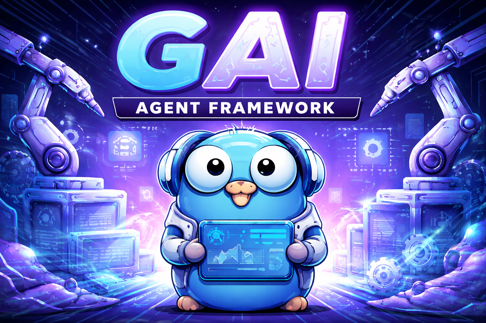

<div align="center">
  <a href="https://github.com/lace-ai/gai">
    
  </a>

  <p><strong>Type-safe, provider-neutral agent runtime for Go.</strong></p>
  <p>Build streaming, tool-using agents across OpenAI, Anthropic, Gemini, and Mistral without hiding provider-native capabilities.</p>

  <p>
    <a href="https://github.com/lace-ai/gai/blob/main/go.mod"></a>
    <a href="https://github.com/lace-ai/gai/actions"></a>
    <a href="https://github.com/lace-ai/gai/blob/main/LICENSE"></a>
    <a href="https://pkg.go.dev/github.com/lace-ai/gai"></a>
  </p>
</div>

GAI is a composable Go runtime for model calls, tools, streaming, context, history, and observability. Shared APIs keep application code provider-neutral, while built-in adapters preserve native tools, structured output, reasoning controls, and message history where supported.

> **Project status:** GAI is pre-v1. It is already usable, but public APIs may still change before the first stable release.

## Try it in one minute

The included order-support example uses a typed local tool and streams the final answer:

```bash
git clone https://github.com/lace-ai/gai.git
cd gai
export OPENAI_API_KEY="..."
go run ./examples/order-support
```

Typical output:

```text
User: Where is order LACE-1042, and when should it arrive?
Assistant: Order LACE-1042 is in transit and has left the Vienna logistics center. Austrian Post currently estimates delivery in 3 days.
```

The wording is generated by the model; the shipping facts come from the local `lookup_order` tool. See [`examples/order-support`](examples/order-support) for the complete program and offline tests.

## Why GAI?

GAI is aimed at Go teams that want a small runtime they can compose into an application instead of a framework that owns the application.

| Requirement | Direct provider SDK | GAI |
|---|---|---|
| Change model providers | Rewrite provider-specific request and stream handling | Keep shared typed contracts and replace the adapter |
| Tool execution loop | Build request mapping, execution, and follow-up turns | Included |
| Streaming order | Provider-specific chunks and lifecycle rules | One ordered event stream |
| Prompt and history budgeting | Application-owned | Built-in primitives |
| Retries and tool iterations | Application-owned | Managed by the loop |
| Tracing | Add instrumentation around every layer | OpenTelemetry spans across agents, models, tools, and workflows |

### Core strengths

- **Typed application boundaries.** Models, messages, tools, structured outputs, workflow inputs, and results use Go types.
- **Provider-neutral without flattening everything.** Built-in adapters preserve native tools, native messages, structured output, usage, and reasoning where available.
- **Causally ordered streaming.** Tokens, attempts, retries, completed iterations, errors, cancellation, and completion arrive through one stream.
- **Composable runtime primitives.** Token budgets, persisted history, optional summarization, middleware stages, debug events, and OpenTelemetry are available without forcing a hosting model.

## Requirements

- Go `1.26.1` or newer
- Credentials for the model provider you use

Install the module in an existing application:

```bash
go get github.com/lace-ai/gai
```

## Build a basic agent

This complete program streams a response from an OpenAI-backed agent:

```go
package main

import (
  "context"
  "fmt"
  "log"
  "os"

  "github.com/lace-ai/gai/agent"
  "github.com/lace-ai/gai/ai/openai"
  gaictx "github.com/lace-ai/gai/context"
  "github.com/lace-ai/gai/loop"
  "github.com/lace-ai/gai/ai"
)

func main() {
  if err := run(context.Background()); err != nil {
    log.Fatal(err)
  }
}

func run(ctx context.Context) error {
  provider := openai.New(os.Getenv("OPENAI_API_KEY"), nil)

  model, err := provider.Model("gpt-4.1-mini")
  if err != nil {
    return err
  }
  defer func() {
    if err := model.Close(); err != nil {
      log.Printf("close model: %v", err)
    }
  }()

  assistant := agent.New(agent.Definition{
    Name:  "assistant",
    Model: model,
    Prompt: func(context.Context, agent.RunInput) (gaictx.PromptBuilder, error) {
      return gaictx.New(gaictx.Definition{
        SystemInstructions: []gaictx.Part{
          gaictx.NewTextPart("You are a concise, helpful assistant."),
        },
      }), nil
    },
  })

  workflow, err := assistant.NewRun(ctx, agent.RunInput{
    Prompt: gaictx.PromptInput{
      User: gaictx.NewTextContent("What is the capital of France?"),
    },
  })
  if err != nil {
    log.Fatal(err)
  }

  var runErr error
  for event := range workflow.RunEvents(ctx) {
    switch event.Type {
    case loop.EventToken:
      if event.Token != nil && event.Token.Type == ai.TokenTypeText {
        if event.Token.Text != "" {
          fmt.Print(event.Token.Text)
        } else {
          fmt.Print(event.Token.String())
        }
      }

    case loop.EventError, loop.EventCanceled:
      runErr = event.Err
    }
  }

  fmt.Println()
  return runErr
}
```

`Workflow.RunEvents` is the preferred API for a primary agent when event order matters. Each workflow is single-use; create a new workflow from the reusable agent definition for each request.

## Providers

GAI currently includes these adapters:

| Provider | Package |
|---|---|
| Anthropic | `ai/anthropic` |
| Gemini | `ai/gemini` |
| Mistral | `ai/mistral` |
| OpenAI | `ai/openai` |

Each provider exposes the shared `ai.Provider` interface:

```go
type Provider interface {
  Name() string
  Model(name string) (Model, error)
  ListModels() ([]string, error)
  Validate() error
}
```

Built-in providers discover compatible models dynamically and use a bundled fallback catalog when discovery is unavailable. Use `ai.ModelRepository` to register multiple providers and resolve models centrally.

## Tools and agent loops

A tool has a typed schema and a Go function:

```go
type Tool interface {
  Name() string
  Description() string
  Params() ai.ToolParameters
  Function(ctx context.Context, req *ai.ToolCall) *ToolResponse
}
```

Tool parameters are converted to JSON Schema for provider-native function calling. Models that do not support native tools can use GAI's text-protocol compatibility path.

```go
func (t *LookupOrderTool) Params() ai.ToolParameters {
  return ai.ToolParameters{
    Strict: true,
    Properties: []ai.ToolParameter{
      {
        Name:        "order_id",
        Type:        ai.ToolParameterString,
        Description: "The order ID to look up.",
        Required:    true,
      },
    },
  }
}

func (t *LookupOrderTool) Function(
  ctx context.Context,
  req *ai.ToolCall,
) *loop.ToolResponse {
  var args struct {
    OrderID string `json:"order_id"`
  }
  if err := loop.DecodeToolArgs(req, &args); err != nil {
    return loop.NewToolError(err)
  }
  return loop.NewToolSuccess(`{"status":"in_transit"}`)
}
```

Attach tools to an agent definition:

```go
support := agent.New(agent.Definition{
  Name:  "support",
  Model: model,
  Tools: []loop.Tool{lookupOrderTool},
  Prompt: supportPrompt,
})
```

The loop sends definitions to the model, executes requested calls, appends tool results to the conversation, and continues until the model commits a normal response or the iteration limit is reached.

`Prompt` must return a fresh, run-owned builder for every invocation. The agent
applies the run input and execution configuration directly to that builder.

For session- or user-specific tools, set `RunInput.Execution.Tools`. A nil slice
inherits `Definition.Tools`; a non-nil slice replaces them, and an empty slice
disables definition-level tools for that run. `NewRun` snapshots the slice's
membership and order, then uses that same snapshot for prompt definitions,
provider requests, and execution. Tool implementations must still be safe for
concurrent use.

```go
workflow, err := support.NewRun(ctx, agent.RunInput{
  Execution: agent.ExecutionConfig{
    Tools: []loop.Tool{lookupOrderToolForUser(userID)},
  },
})
```

`Execution.ToolChoice` configures tool choice for a single run.
`Execution.Reasoning` optionally overrides `Definition.Reasoning` for that run.

## Ordered workflow events

`RunEvents` forwards the loop's event stream without splitting it into unrelated channels:

```go
for event := range workflow.RunEvents(ctx) {
  switch event.Type {
  case loop.EventAttemptStart:
    // A generation attempt began.
  case loop.EventToken:
    // Stream visible text or inspect other token types.
  case loop.EventRetry:
    // Roll back output associated with event.AttemptID.
  case loop.EventIterationDone:
    // One model/tool iteration completed.
  case loop.EventDone:
    // The loop completed successfully.
  case loop.EventError, loop.EventCanceled:
    // Handle terminal failure or cancellation.
  }
}
```

`Workflow.Run` remains available for workflows that use post-processing middleware. It exposes compatibility token, status, and error channels; consumers must drain all three concurrently.

## Retries

Retries are opt-in. A loop or agent with no `RetryPolicy` performs one model-generation attempt and returns the original error; it never emits a retry event. Configure an explicit policy when classified transient failures, rate limits, or attempt timeouts should retry:

```go
policy := &loop.RetryPolicy{
  MaxRetries:     3,
  InitialBackoff: time.Second,
  MaxBackoff:     10 * time.Second,
}

support := agent.New(agent.Definition{
  Name:        "support",
  Model:       model,
  Prompt:      supportPrompt,
  RetryPolicy: policy,
})
```

`Loop.RetryCount`, `agent.Limits.RetryCount`, and `summary.WithRetryCount` were removed while GAI is pre-v1. Migrate to `loop.RetryPolicy{MaxRetries: n}` or `summary.WithRetryPolicy(loop.RetryPolicy{MaxRetries: n})`. Runtime event retry counters remain available for observability.

## Prompt and context construction

The `context` package builds prompts from separate, typed inputs:

- system instructions;
- dynamic context sources;
- named machine context;
- genuine user content;
- assistant and tool conversation messages;
- token budgets and an output reserve.

Import it with an alias to avoid colliding with the standard library package:

```go
import gaictx "github.com/lace-ai/gai/context"
```

```go
builder := gaictx.New(gaictx.Definition{
  Renderer: &gaictx.XMLRenderer{},
  SystemInstructions: []gaictx.Part{
    gaictx.NewTextPart("Follow the application policy."),
  },
  ContextSources: []gaictx.ContextSource{
    history.NewHistory(sessionID, historyStore),
  },
  TokenBudget:        128000,
  OutputTokenReserve: 4096,
})
```

`BuildContext` allocates budget to context sources. `BuildPrompt` then renders the current user input and accumulated conversation for each loop iteration.

## History and summarization

`context/history` provides a `ContextSource` backed by a `HistoryStore`. It loads persisted state, selects recent turns that fit the available budget, and reuses cached per-turn token counts.

Use `history.NewHistory(sessionID, store)` for budgeted history selection. Use `history.New(sessionID, store, summarizerDefinition)` when older turns should be summarized under token pressure. The built-in `agent/summary` package can supply the summarizer agent.

## Structured output and direct model calls

Call a model directly when no agent loop is needed or when you want provider-native request controls:

```go
response, err := model.Generate(ctx, ai.AIRequest{
  Prompt:    "Return one JSON object describing Paris.",
  MaxTokens: 200,
  ResponseFormat: ai.ResponseFormat{
    Type: ai.ResponseFormatJSONObject,
  },
  Reasoning: ai.ReasoningConfig{
    Enabled: true,
    Effort:  ai.ReasoningEffortLow,
  },
})
if err != nil {
  return err
}
fmt.Println(response.Text)
```

`AIRequest.Messages` can carry provider-neutral native user, assistant, and tool-result history. When it is empty, `Prompt` remains the rendered compatibility fallback.

## Workflow middleware

Middleware stages run after an upstream agent completes and are suited to tasks such as memory extraction, auditing, formatting, and evaluation.

`agent.NewAgentMiddleware` adapts another agent with one of three output policies:

- `PreserveOutput` keeps the upstream output and records the stage result.
- `AppendOutput` emits the stage output after the upstream output.
- `ReplaceOutput` replaces the visible output after a successful stage.

Use `AgentMiddlewareConfig.MapInput` to map a typed upstream `WorkflowResult` into the next agent's `RunInput`. Use `MiddlewareFunc` for transformations that do not need another model call.

Middleware is post-processing, not a supervisor or handoff runtime. Tool authorization and approval belong at the tool-execution boundary rather than in workflow middleware.

## Observability

GAI creates OpenTelemetry spans across agent runs, workflows, model attempts, and tools. Safe metadata is recorded by default; prompts, completions, reasoning, tool arguments, tool results, and metadata values are not exported unless the application deliberately enables them.

Set `Definition.DebugSink` for structured lifecycle events. Install any OpenTelemetry-compatible exporter before creating agents.

The optional `observability/langfuse` package provides a batched OTLP tracer provider for Langfuse:

```go
provider, err := langfuse.NewTracerProvider(ctx, langfuse.Config{
  Endpoint:    "https://cloud.langfuse.com/api/public/otel",
  PublicKey:   os.Getenv("LANGFUSE_PUBLIC_KEY"),
  SecretKey:   os.Getenv("LANGFUSE_SECRET_KEY"),
  ServiceName: "my-agent-service",
})
if err != nil {
  return err
}
defer func() {
  if err := provider.Shutdown(context.Background()); err != nil {
    log.Printf("flush Langfuse traces: %v", err)
  }
}()
otel.SetTracerProvider(provider)
```

The caller owns provider shutdown so the final batch can be flushed and any export error can be observed.

Trace-wide filtering dimensions are opt-in and separate from `RunInput.Meta`:

```go
traceContext := &gai.TraceContext{
  Name:        "lace-chat",
  UserID:      userID,
  SessionID:   conversationID,
  Tags:        []string{"mobile"},
  Release:     version,
  Environment: "production",
  Metadata: map[string]string{
    "feature": "chat",
  },
}

workflow, err := assistant.NewRun(ctx, agent.RunInput{
  TraceContext: traceContext,
  Prompt:       input,
  Meta:         applicationData, // values are still never exported implicitly
})
```

`RunInput.TraceContext == nil` inherits trace dimensions already installed with
`gai.WithTraceContext`; a non-nil value replaces them as a complete set. GAI
copies and validates the value before asynchronous work starts. Scalar values
are limited to 200 bytes, tags to 32 values of 200 bytes, and selected metadata
to 32 entries with 64-byte alphanumeric keys and 200-byte values. Invalid or
oversized entries are omitted instead of truncated. Trace context uses an internal Go
context value, not OpenTelemetry baggage, so GAI does not add user or session
identifiers to outbound request headers.

Environment values are trimmed and normalized to lowercase. They may contain
letters, digits, hyphens, and underscores; values beginning with `langfuse` are
reserved by Langfuse and omitted.

The core library records provider-neutral `gai.trace.*` attributes. The
Langfuse tracer provider maps them to Langfuse v4 trace attributes on every
span. Applications assembling their own Langfuse tracer provider can wrap a
span processor with `langfuse.NewTraceContextSpanProcessor` to use the same
mapping.

Every OpenAI, Mistral, Gemini, and Anthropic model invocation also creates one
`chat {requested_model}` client span. Streaming spans remain open until the
stream ends or is canceled. They use the same `gen_ai.*` contract for requested
and resolved models, finish reasons, request IDs, reported token usage, and
provider HTTP status. Langfuse generation type, model parameters, usage
details, and completion-start time are included where known. Prompts,
completions, reasoning, tool arguments, and raw provider payloads are not
attached to these spans.

The older `ai.provider`, `ai.model`, `ai.max_tokens`, `ai.input_tokens`,
`ai.output_tokens`, `ai.reasoning_tokens`, and `ai.tool_call_count` attributes
remain during the semantic-attribute migration. New integrations should use
the `gen_ai.*` attributes.

Every tool invocation executed through `Loop` creates one `loop.tool` child
span. Direct calls to `CallTool` are not instrumented.

| Attribute | Value |
| --- | --- |
| `loop.operation` | `tool` |
| `gen_ai.operation.name` | `execute_tool` |
| `gen_ai.tool.name`, `gen_ai.tool.call.id` | Stable tool name and model-issued call ID |
| `gen_ai.tool.type` | `function` |
| `langfuse.observation.type` | `tool` |
| `gai.tool.outcome` | `success`, `tool_error`, `panic`, `deadline`, `cancellation`, or `missing_response` |
| `error.type` | Fixed `gai.tool.*` classification on failures |
| `tool.name`, `tool.call_id`, `tool.status` | Legacy compatibility attributes |

Span errors use fixed, low-cardinality classifications; raw tool errors and
panic values are never exported implicitly. A panic is recorded and then
rethrown unchanged.

Tool arguments and results are absent by default. Enable them independently
with the same request-scoped capture policy used for other sensitive content:

```go
ctx = gai.WithContentCapturePolicy(ctx, gai.ContentCapturePolicy{
  ToolInput:  gai.CaptureEnabled,
  ToolOutput: gai.CaptureEnabled,
  MaxBytes:   4096,
  Redact: func(ctx context.Context, kind gai.ContentKind, value []byte) ([]byte, error) {
    return redactApplicationSecrets(value), nil
  },
})
```

Captured input is written to `gen_ai.tool.call.arguments` and
`langfuse.observation.input`; captured output is written to
`langfuse.observation.output`, and successful output is also written to
`gen_ai.tool.call.result`. The legacy `tool.input` and `tool.output` attributes
remain during migration and carry the redaction, truncation, and byte-count
metadata. Content is captured once and reused for every applicable alias.
Valid JSON remains serialized JSON; invalid JSON is retained as bounded UTF-8
text. Redactor errors and panics fail closed.

## Package map

```text
agent/                   Reusable agent definitions, workflows, middleware, and summary agents
ai/                      Provider-neutral requests, responses, tools, capabilities, and providers
context/                 Prompt construction, rendering, structured input, and messages
context/history/         Persisted history selection and optional summarization
loop/                    Ordered model/tool execution and tool helpers
observability/langfuse/  Optional Langfuse OpenTelemetry exporter setup
testutil/                Mocks and helpers used by tests
```

## Development

Run the full test suite:

```bash
go test ./...
```

Useful focused commands:

```bash
go test ./ai/...
go test ./agent/...
go test ./context/...
go test ./loop/...
go test ./examples/order-support
```

GitHub Actions runs build, vet, tests, race detection for concurrency-sensitive packages, static analysis, coverage artifact generation, and public API compatibility checks on pull requests. Dependency vulnerability scanning runs weekly on Mondays at 03:17 UTC and can also be started manually from the Actions tab.

## Contributing

Issues and pull requests are welcome. For a new provider or tool, include tests and document its constructor, supported behavior, and required environment variables.

Before making a large API change, open an issue describing the use case and compatibility impact. GAI is still pre-v1, but migrations should remain deliberate and documented.

## License

GAI is available under the [MIT License](LICENSE).

Copyright (c) 2026 Samuel Konrad.
